# Web 数据可视化 Web Data Visualization

::: tip

Web 数据可视化，使用交互式图表的形式，帮助用户理解、分析数据信息，从而，更好地做出决策。 

:::

## 1. Web 数据可视化的本质是什么？

### 1-1. 概述

Web 数据可视化`Web Data Visualization`，是指使用Web技术实现的数据可视化方式，例如基于HTML、CSS和JavaScript技术的数据可视化库或者框架。在这种方式下，用户可以通过Web浏览器轻松地访问和交互式地探索数据图表。Web端数据可视化还能够将数据直接从Web应用程序或后端数据源中，实时地传输和呈现在用户浏览器中。以此来满足用户在数据可视化上的需求，提高用户对数据的理解和分析能力。

### 1-2. 擅长做什么？

Web端数据可视化擅长用于展示和分析数据，可以帮助用户更好地理解数据和获取数据中的信息。以下是Web端数据可视化擅长的几个方面： 
 
1. 用于分析趋势和模式：Web端数据可视化可以展示数据的趋势和模式，以便用户了解数据的发展和变化趋势。 
2. 用于比较数据：用户可以使用Web端数据可视化比较多个数据集之间的差异和相似之处，以便更好地了解数据的差异和相似之处。 
3. 用于探索数据：Web端数据可视化可以让用户在大量数据中探索并发现信息，从而更好地了解数据中的模式和趋势。 
4. 用于实时数据分析：Web端数据可视化可以实时地分析数据，并将结果可视化展示在用户的浏览器中，以便用户实时了解数据的最新状态和变化情况。 
5. 用于决策支持：Web端数据可视化可以将复杂的数据数据转化为图形，以便用户更好地理解数据，并支持用户更好地做出决策。 

### 1-3. 局限性是什么？

Web端数据可视化也有一些局限性，例如：

1. 数据安全：因为Web上的数据可视化是基于网络的，所以数据的保密性和安全性是需要考虑的问题。
2. 数据可靠性：因为Web端数据可视化可能会涉及到从多个数据源收集数据，所以数据的准确性和一致性也是需要考虑的问题。
3. 大规模数据：当需要处理大量数据时，Web端数据可视化有可能会因为数据过于庞大而导致图表呈现缓慢和响应不及时。
 
### 1-4. 实际运用的领域

Web端数据可视化可以在各种领域中实现数据分析和可视化，包括但不限于：

1. 金融服务：用于展示股票、交易和账户数据的实时数据可视化应用程序。
2. 电子商务：用于显示销售数据、客户行为和流量分析的数据可视化应用程序。
3. 医疗保健：用于医疗数据分析、研究和决策支持的数据可视化应用程序。
4. 社交媒体：用于分析和可视化社交媒体数据，例如推特上的热门话题和用户趋势等。

## 2. 建立 Web 数据可视化知识体系？

### 2-1. Web 数据可视化知识体系

### 2-2. 如何学习 web 数据可视化?

学习 Web 数据可视化可以从以下几个步骤开始：
1. 了解一些基本的数据可视化原理和方法，例如数据可视化的分类、图表类型、数据驱动等概念。
2. 学习一些常见的 Web 数据可视化工具和框架，例如 D3.js、Echarts、Highcharts 等，掌握它们的基本使用方法和原理。
3. 实践一些具体的 Web 数据可视化项目，例如使用 D3.js 作为工具，完成一个可交互的数据可视化项目。
4. 学习一些前端开发的基础知识，例如 HTML、CSS、JavaScript 等，以便更好地掌握 Web 数据可视化工具和框架。

以下是一些学习 Web 数据可视化的链接：
1. D3.js 官网：https://d3js.org/
2. Echarts 官网：https://echarts.apache.org/zh/index.html
3. Highcharts 官网：https://www.highcharts.com/
   
希望这些链接可以帮助你更好地学习 Web 数据可视化。

